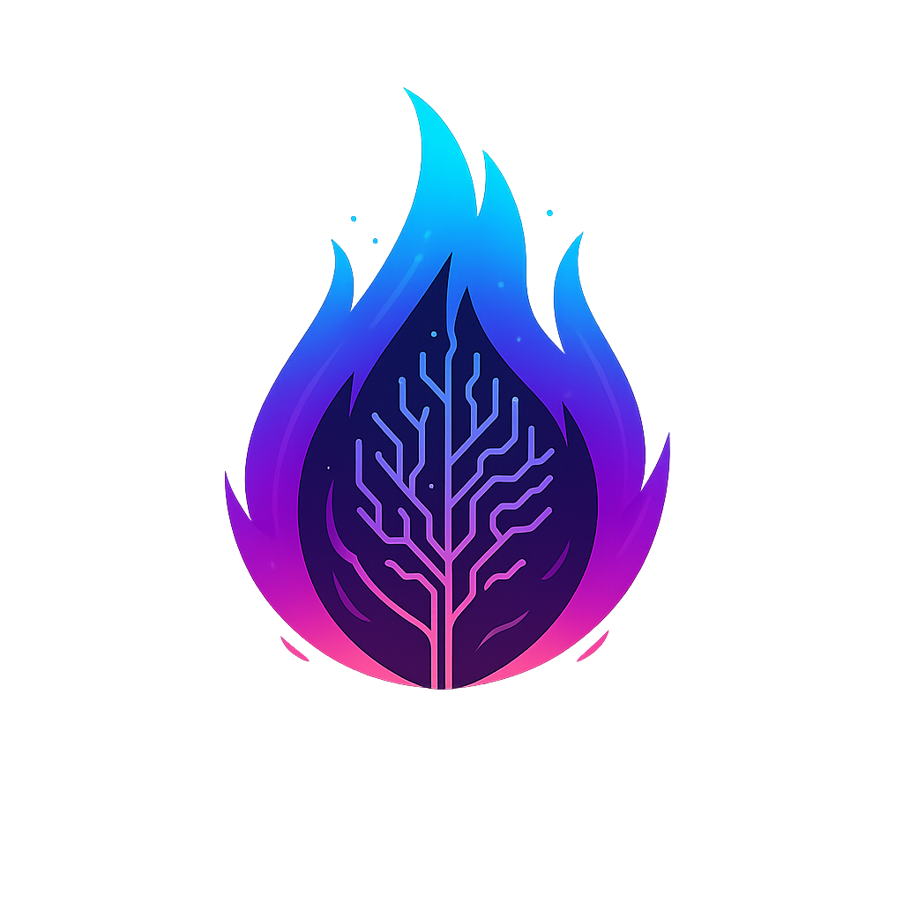
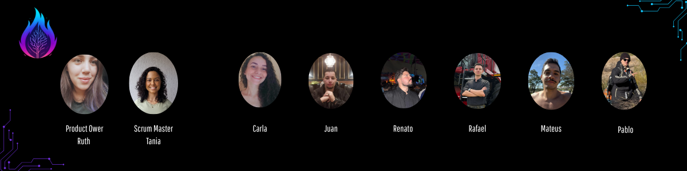

<div align="center">



# ATHOS
### Database 6° Semester

</div>

<p align="center">
  <a href ="#busts_in_silhouette-members">  Team </a> •
  <a href ="#pushpin-hiathos-project">  HiATHOS Project </a> •
  <a href="#white_check_mark-requirements">  Requirements </a> •
  <a href="#card_file_box-product-backlog"> Product Backlog </a> •
  <a href="#calendar-sprints-backlog"> Sprints Backlog </a> •
  <a href="#hourglass_flowing_sand-roadmap"> Roadmap </a>•
  <a href="#computer-tech-stack"> Tech Stack </a> •
  <a href="#gear-branching-and-commit-standard-strategies"> Branching and Commit Standard Strategies </a> • 
  <a href="#gear-quality-gate"> Quality Gate </a> •
  <a href="#gear-documentation"> Documentation </a> •

</p>

<h1 align="center" id="busts_in_silhouette-members">Team</h1>

<div align="center">
  
</div>

<br/>
<br/>
<div align="center">

| Member | Role | Social |
|-------------| - |---------------|
| Ruth Mira | Product Owner | <a href="https://www.linkedin.com/in/ruth-mira/?originalSubdomain=br"></a> <a href="https://github.com/RuthMira"></a> |
| Tânia Cruz | Scrum Master | <a href="https://www.linkedin.com/in/t%C3%A2nia-cruz-30ab5812a/"></a> <a href="https://github.com/taniacruzz"></a> |
| Carla Daiane | Developer | <a href="https://www.linkedin.com/in/carla-daiane/"></a> <a href="https://github.com/carladaiane"></a> |
| Juan Cursino  | Developer | <a href="https://www.linkedin.com/in/juan-cursino"></a> <a href="https://github.com/JuanCursino"></a> |
| Mateus Soares  | Developer | <a href="https://www.linkedin.com/in/mateus-soares-4983681a0?utm_source=share&utm_campaign=share_via&utm_content=profile&utm_medium=ios_app"></a> <a href="https://github.com/MateusMSoares"></a> |
| Pablo Gregório | Developer | <a href="https://www.linkedin.com/in/pablo-henrique05/"></a> <a href="https://github.com/pablohgs05"></a> |
| Rafael Trevizoli | Developer | <a href="https://www.linkedin.com/in/rafael-trevizoli/"></a> <a href="https://github.com/rtrevizoli"></a> |
| Renato Mendes | Developer | <a href="https://www.linkedin.com/in/renato-mendes-61a6481a4"></a> <a href="https://github.com/RenatoCMMendes"></a> |


</div>

<br/>

<h1 id="pushpin-hiathos-project">📌 HiAthos</h1>
Project executed in collaboration with <a href="https://www.tecsysbrasil.com.br/">TECSYS</a>.

## **Project Challenge**
<p align="justify">
Electric power distribution companies operate in a highly regulated environment where service quality indicators directly affect regulatory compliance, operational efficiency, and financial performance.
</p>

<p align="justify">
However, critical information about network reliability, service interruptions, and technical losses is often dispersed across multiple public ANEEL sources, making analysis fragmented, slow, and difficult to standardize.
</p>

<p align="justify">
As a result, technical and commercial teams struggle to:
<ul>
<li>obtain a clear comparative view of network performance across utilities, regions, and electrical groupings;</li>
<li>identify areas with higher operational risk;</li>
<li>prioritize infrastructure investments and corrective actions;</li>
<li>monitor long-term trends in DEC and FEC indicators efficiently.</li>
</ul>
</p>

<p align="justify">
Without a centralized analytical solution, these evaluations depend on manual effort, disconnected datasets, and limited visibility, reducing decision-making quality and making regulatory analysis more time-consuming.
</p>

## **Solution — HiAthos**

<p align="justify">
HiATHOS is an analytical web platform developed to centralize, organize, and process public ANEEL data, transforming regulatory information into structured indicators for electric power distribution analysis.
</p>

<p align="justify">
The platform automates the collection of public datasets, stores them in a structured database, and enables users to analyze network continuity indicators such as DEC and FEC across different utilities, regions, and electrical groupings.
</p>

<p align="justify">
Through this approach, HiATHOS helps technical and commercial teams:
<ul>
<li>access consolidated regulatory data in a single environment;</li>
<li>compare operational performance across different network segments;</li>
<li>identify regions approaching or exceeding regulatory limits;</li>
<li>support decision-making for monitoring, prioritization, and future analytical expansion.</li>
</ul>
</p>

<p align="justify">
Its main features include:
<ul>
<li>Automated collection of regulatory data from ANEEL;</li>
<li>Analysis of continuity indicators such as DEC and FEC;</li>
<li>visualization of comparative analytical data; </li>
<li>User management with access control;</li>
<li>system logging for technical monitoring and traceability. </li>
</ul>
</p>

<p align="justify">
HiATHOS was designed with an architecture that supports future evolution, including analytical intelligence modules and predictive capabilities for electrical network behavior.
</p>

<br>

<h1 id="white_check_mark-requirements">✅ Requirements</h1>

<details>
  <summary><b>Functional Requirements</b></summary>

## Functional Requirements

| ID | Requirement | Description |
|---|---|---|
| RF01 | User Registration, Authentication and Access Control | The system must allow new users to self-register with full name, email, password, and optional phone number. Every new user must be created with `PENDING` status. Only users with `ACTIVE` status may access the platform. The system must also support secure authentication, mandatory password change on the first login of the initial administrator, and a controlled email-change flow with identity validation. |
| RF02 | Administrative User Management | The system must allow administrators to view, search, filter, and manage registered users, including approval, rejection with mandatory justification, profile updates when necessary, anonymization of personal data, and granting or removing administrative privileges. |
| RF03 | Terms, Acknowledgements and Consent Management | The system must display the Terms of Use, Privacy Notice, and optional marketing consent during user registration, recording acceptance, acknowledgement, and optional consent separately. The system must keep version history of terms, maintain historical records, and allow optional consent revocation without affecting access to core platform features. |
| RF04 | Data Subject Rights and Privacy Requests | The system must support handling data subject requests related to access, correction, anonymization, or deletion when applicable, and must keep a minimal record of such requests as well as a basic inventory of personal data processing operations related to the user module. |
| RF05 | System Logging and Log Access | The system must record authentication logs, user-management logs, and relevant application execution events, including critical administrative operations. These records must contain the minimum information required for auditability and traceability, with access restricted to authorized administrators and logical separation from the main application database. |
| RF06 | Automatic and Manual ANEEL Data Collection | The system must perform periodic automatic collection of public ANEEL data and also allow manual execution by authorized administrators in order to obtain regulatory data for future analysis, indicators, and rankings. |
| RF07 | Validation, Processing and Storage of Collected Data | The system must validate the structure and format of collected files, process and normalize accepted data, reject or flag data incompatible with the expected model, store processed records with source and batch traceability, and prevent improper duplication during reprocessing or recurring imports. |
| RF08 | Historical Preservation and Data Consistency | The system must preserve the history of valid data, term versions, acceptance records, and relevant events, ensuring consistency between the active database, logs, anonymization records, and backup restoration processes. |
| RF09 | Analytical Visualization and Operational Ranking | The system must allow users to view a ranked analytical table based on previously collected and stored data from ANEEL public datasets, initially displaying DEC, DEC limit, FEC, and FEC limit indicators. It must support filtering by year, distributor, state, electrical group, and substation, as well as sorting by indicators and identifying regions near or above regulatory limits. The system must also support visual or logical classification of operational units based on the comparison between measured indicators and regulatory thresholds, and preserve structural compatibility for future inclusion of complementary indicators such as technical and non-technical losses without compromising the main continuity-focused visualization. |
| RF10 | Geographical Visualization of Operational Indicators | The system must allow geographical visualization of electrical network operational indicators based on previously collected and stored data from ANEEL public datasets and the available geographic base, initially presenting DEC and FEC indicators in heatmap format. It must support filtering by year, month when available, distributor, state, electrical group, and substation, as well as selection of the indicator shown on the map. The system must preserve structural compatibility for future inclusion of technical and non-technical losses in the geographic view, as well as future evolution toward network-segment and electrical-circuit granularity. |

</details>

<details>
  <summary><b>Non-Functional Requirements</b></summary>

## Non-Functional Requirements

| ID | Requirement | Description |
|---|---|---|
| RNF01 | Security and Credential Protection | The system must store passwords only using secure cryptographic hashing. The initial administrator credential must not be stored in source code, versioned scripts, or public documentation, and must be provisioned through a secure mechanism. |
| RNF02 | Access Control and Confidentiality | The system must restrict access to features, user data, and logs according to user role and need-to-know rules, ensuring that only authorized administrators can perform sensitive operations or access restricted records. |
| RNF03 | LGPD Compliance and Data Minimization | The system must comply with the principles of purpose limitation, necessity, adequacy, security, transparency, and accountability, collecting and processing only the data strictly necessary for platform operation. |
| RNF04 | Integrity and Traceability | The system must ensure traceability of critical actions and integrity of user records, terms, consents, anonymization actions, data collection executions, and logs, without improper overwriting of historical records. |
| RNF05 | Data Protection in Logs | The system must not record passwords, tokens, secrets, session cookies, or full payloads containing unnecessary personal data in logs, and should use pseudonymization or masking whenever possible. |
| RNF06 | Data Retention and Disposal | The system must adopt a retention policy compatible with the purpose of each type of data, including an approximate retention period of 6 months for logs, 90 days for backups, and controlled retention of acceptance and consent records according to the project policy. |
| RNF07 | Backup and Anonymization Consistency | Backup restoration must not automatically reactivate data that has already been anonymized or deleted from the active database. The system must provide a technical mechanism to reapply anonymization when necessary. |
| RNF08 | Operational Simplicity and Maintainability | The solution must prioritize implementation simplicity, low operational cost, ease of maintenance, and logical separation between operational data, logs, and collected regulatory data. |
| RNF09 | Basic Availability and Scalability | The system must support the expected initial volume of users, logs, and periodic data collection jobs, while allowing future growth without compromising essential MVP functionality. |
| RNF10 | Minimum Usability | The interfaces for registration, user management, log consultation, and administrative operations must be clear, objective, and appropriate for the expected use within the initial project scope. |
| RNF11 | Minimum Performance for Analytical Queries | The analytical visualization functionality must respond adequately to the initial project data volume, supporting filtering and sorting without compromising the basic MVP user experience. |
| RNF12 | Clarity of Ordering and Interpretation | The ranking interface must clearly indicate the applied sorting criteria and present indicators in a way that is understandable to users, avoiding ambiguity in analytical interpretation. |
| RNF13 | Separation Between Analytical Data and Personal Data | The ranking functionality must operate exclusively on public and aggregated ANEEL data within the current scope, without displaying or depending on platform users' personal data. |
| RNF14 | Minimum Performance for Geographical Visualization | The heatmap functionality must respond adequately to the initial data volume and filter set expected for the MVP. |
| RNF15 | Visual Clarity and Interpretability | The heatmap interface must provide a clear legend, an understandable visual scale, and clear distinction between different levels of criticality. |
| RNF16 | Separation Between Geographic Analytical Data and Personal Data | The heatmap functionality must operate exclusively on public, aggregated, and geographic electrical network data within the current scope, without displaying or depending on personal data. |

</details>


<br>

<h1 id="card_file_box-product-backlog">🗂 Product Backlog</h1> 

| Id | Prioridade | User Story | Estimativa | Sprint |
| -- | ---------- | ---------- | ---------- | ------ |
| [ATS-7: User management](docs/User%20management.md) | Highest | As a user of Tecsys’ energy analytics system, I want to be able to register by providing basic platform access information, so that I can request access to the system and use its analytical features after administrative approval. | 5 | 1 |
| [ATS-4: Auditing and logging](docs/Auditing%20and%20logging.md) | Highest | As an administrator of Tecsys’ energy analytics system, I want the system to record logs of critical operations performed on the platform, so that it is possible to trace activities, identify failures, and ensure auditability of the actions carried out by users. | 3 | 1 |
| [ATS-5: Data collection and processing](docs/Data%20collection%20and%20processing.md) | Highest | As a user of Tecsys’ energy analytics system, I want the system to automatically collect public data from ANEEL regarding energy quality and losses, so that this information can be stored and used later. | 8 | 1 |
| [ATS-6: Performance ranking](https://athos-software.atlassian.net/browse/ATS-6) | Medium | As a user of Tecsys’ energy analytics system, I want to view an analytical table containing operational indicators of the electrical network and market estimates (TAM and SAM), so that it is possible to identify regions with higher operational risk and greater revenue recovery potential. | 8 | 2 |
| [ATS-13: Heatmap](https://athos-software.atlassian.net/browse/ATS-13) | Medium | As a user of Tecsys’ energy analytics system, I want to view a heatmap displaying electrical network quality and loss indicators, so that I can identify regions with higher operational risk and greater financial impact. | 8 | 2 |
| [ATS-14: Business report (ROI)](https://athos-software.atlassian.net/browse/ATS-14) | Lowest | As a user of Tecsys’ energy analytics system, I want to view analytical reports on the economic impact associated with energy losses, so that I can identify regions with greater revenue recovery potential. | 8 | 3 |
| [ATS-15: Forecasting agent](https://athos-software.atlassian.net/browse/ATS-15) | Lowest | As an analyst of Tecsys’ energy analytics system, I want to use an AI-based forecasting agent to estimate future trends in electrical network indicators, so that I can anticipate regions with a higher risk of outages or energy losses. | 8 | 3 |


<br>

<h1 id="calendar-sprints-backlog">📅 Sprints Backlog</h1> 

<details>
  <summary><b>Sprint 1</b></summary>

  ### **Sprint 1: Planning and Execution**

* **Estimated Team Capacity:** 16 Story Points
* **Sprint Goal:** Deliver user stories `ATS-7: User Management` and `ATS-4: Auditing and Logging` (8 story points total).
* **Sprint Forecast (Stretch goals — non-committed items):** The major user story `ATS-5: Data Collection and Processing` (8 story points) can be started after the sprint goal is completed.

| Id | Prioridade | User Story | Estimativa | Sprint |
| -- | ---------- | ---------- | ---------- | ------ |
| [ATS-7: User management](docs/User%20management.md) | Highest | As a user of Tecsys’ energy analytics system, I want to be able to register by providing basic platform access information, so that I can request access to the system and use its analytical features after administrative approval. | 5 | 1 |
| [ATS-4: Auditing and logging](docs/Auditing%20and%20logging.md) | Highest | As an administrator of Tecsys’ energy analytics system, I want the system to record logs of critical operations performed on the platform, so that it is possible to trace activities, identify failures, and ensure auditability of the actions carried out by users. | 3 | 1 |
| [ATS-5: Data collection and processing](docs/Data%20collection%20and%20processing.md) | Lowest | As a user of Tecsys’ energy analytics system, I want the system to automatically collect public data from ANEEL regarding energy quality and losses, so that this information can be stored and used later. | 8 | 1 |

### Definition of Done (DoD)
For a User Story to be considered **complete**, the following criteria must be met:
- The code has been written, locally tested, and is clean (following team standards).
- Technical documentation has been updated by the developers.
- The functionality has been integrated into the branch: **develop**.
- All **automated tests** have been created and successfully executed.
- The **User Story acceptance criteria** have been fulfilled.
- The interface complies with **usability principles**, providing clear and consistent navigation for the end user.
- The task complies with **LGPD (data protection) principles**.
- The functionality has been **tested and approved by the Product Owner (PO)**.

### Definition of Ready (DoR)
For a User Story to be ready to start in a sprint, the following criteria must be met:
- Mandatory items already defined
- It has a clear **title, description, and objective**.
- **Acceptance criteria and business rules** are defined.
- **Priority** has been established.
- **Required data or system access** is available, or an alternative plan has been defined.
- The **effort** has been estimated by the team.
- **Supporting artifacts** have been provided (e.g., wireframes, mockups, diagrams).

</details>

<details>
  <summary><b>Sprint 2</b></summary>

### **Sprint 2: Execution and Planning**

* **Estimated Team Capacity:** 16 Story Points
* **Sprint Goal:** Deliver user stories `ATS-6: Performance Ranking` and `ATS-13: Heatmap` (16 story points total).
* **Sprint Forecast (Stretch goals — non-committed items):** No additional stretch goals are planned for this sprint.

| Id | Prioridade | User Story | Estimativa | Sprint |
| -- | ---------- | ---------- | ---------- | ------ |
| [ATS-6: Performance ranking](https://athos-software.atlassian.net/browse/ATS-6) | Medium | As a user of Tecsys’ energy analytics system, I want to view an analytical table containing operational indicators of the electrical network and market estimates (TAM and SAM), so that it is possible to identify regions with higher operational risk and greater revenue recovery potential. | 8 | 2 |
| [ATS-13: Heatmap](https://athos-software.atlassian.net/browse/ATS-13) | Medium | As a user of Tecsys’ energy analytics system, I want to view a heatmap displaying electrical network quality and loss indicators, so that I can identify regions with higher operational risk and greater financial impact. | 8 | 2 |

### Definition of Done (DoD)
For a User Story to be considered **complete**, the following criteria must be met:
- The code has been written, locally tested, and is clean (following team standards).
- Technical documentation has been updated by the developers.
- The functionality has been integrated into the branch: **develop**.
- All **automated tests** have been created and successfully executed.
- The **User Story acceptance criteria** have been fulfilled.
- The interface complies with **usability principles**, providing clear and consistent navigation for the end user.
- The task complies with **LGPD (data protection) principles**.
- The functionality has been **tested and approved by the Product Owner (PO)**.

### Definition of Ready (DoR)
For a User Story to be ready to start in a sprint, the following criteria must be met:
- Mandatory items already defined
- It has a clear **title, description, and objective**.
- **Acceptance criteria and business rules** are defined.
- **Priority** has been established.
- **Required data or system access** is available, or an alternative plan has been defined.
- The **effort** has been estimated by the team.
- **Supporting artifacts** have been provided (e.g., wireframes, mockups, diagrams).

</details>

<details>
  <summary><b>Sprint 3</b></summary>

### **Sprint 3: Execution and Planning**

* **Estimated Team Capacity:** 16 Story Points
* **Sprint Goal:** Deliver user stories `ATS-14: Business Report (ROI)` and `ATS-15: Forecasting Agent` (16 story points total).
* **Sprint Forecast (Stretch goals — non-committed items):** This sprint is focused on planned delivery only, with no additional stretch goals.

| Id | Prioridade | User Story | Estimativa | Sprint |
| -- | ---------- | ---------- | ---------- | ------ |
| [ATS-14: Business report (ROI)](https://athos-software.atlassian.net/browse/ATS-14) | Lowest | As a user of Tecsys’ energy analytics system, I want to view analytical reports on the economic impact associated with energy losses, so that I can identify regions with greater revenue recovery potential. | 8 | 3 |
| [ATS-15: Forecasting agent](https://athos-software.atlassian.net/browse/ATS-15) | Lowest | As an analyst of Tecsys’ energy analytics system, I want to use an AI-based forecasting agent to estimate future trends in electrical network indicators, so that I can anticipate regions with a higher risk of outages or energy losses. | 8 | 3 |

### Definition of Done (DoD)
For a User Story to be considered **complete**, the following criteria must be met:
- The code has been written, locally tested, and is clean (following team standards).
- Technical documentation has been updated by the developers.
- The functionality has been integrated into the branch: **develop**.
- All **automated tests** have been created and successfully executed.
- The **User Story acceptance criteria** have been fulfilled.
- The interface complies with **usability principles**, providing clear and consistent navigation for the end user.
- The task complies with **LGPD (data protection) principles**.
- The functionality has been **tested and approved by the Product Owner (PO)**.

### Definition of Ready (DoR)
For a User Story to be ready to start in a sprint, the following criteria must be met:
- Mandatory items already defined
- It has a clear **title, description, and objective**.
- **Acceptance criteria and business rules** are defined.
- **Priority** has been established.
- **Required data or system access** is available, or an alternative plan has been defined.
- The **effort** has been estimated by the team.
- **Supporting artifacts** have been provided (e.g., wireframes, mockups, diagrams).

</details>

<br>

<h1 id="hourglass_flowing_sand-cronograma-da-api"> 📊Burndown </h1>

<details>
  <summary><strong>Sprint 1</strong></summary>
  


</details>

<details>
  <summary><strong>Sprint 2</strong></summary>
  

</details>
<details>
  <summary><strong>Sprint 3</strong></summary>
  

</details>

<br>

<h1 id="hourglass_flowing_sand-roadmap"> ⏳ Roadmap </h1>

- [x] March 02 to March 06 - Kick-off
- [x] March 16 to April 05 - Sprint 1
- [ ] April 06 to April 10 - Sprint Review / Planning
- [ ] April 13 to May 03 - Sprint 2
- [ ] May 04 to May 08 - Sprint Review / Planning
- [ ] May 11 to May 31 - Sprint 3
- [ ] June 01 to June 05 - Sprint Review
- [ ] June 11 - Project Fair and Final API Presentation

<br>

<h1 id="computer-tech-stack">💻 Tech Stack </h1> 

<div align="center">


</div>

<br>

<h1 id="gear-branching-and-commit-standard-strategies">🌿 Branching and Commit Standard Strategies</h1>

<details>
  <summary><b>Branching</b></summary>


#### **Logic**

`feature/*` → Development of new features  
`develop` → Continuous integration of features (staging / testing environment)  
`release` → Delivery version for production. Always stable  
`hotfix/*` → Urgent fixes applied directly to the release

---

#### **Feature Branch Naming**

Start with the **Task ID in uppercase**, followed by a slash (`/`).
The description must use **lowercase words separated by hyphens (`-`)**, with no spaces.

**Example:** `ATS-01/login-screen`

---

#### **Workflow**

##### **Creating Feature Branches**

Update your local `develop` branch:

```bash
git fetch --all
git checkout develop
git pull
```

From the `develop` branch, create a feature branch:

```bash
git checkout -b ATS-XX/feature-name
```

Develop the functionality and update the feature branch using `git add`, `commit`, and `push`.

To keep your feature branch up to date with `develop`:

```bash
git fetch --all
git checkout develop
git pull
git checkout ATS-XX/feature-name
git merge develop
```

Resolve conflicts if necessary.

Open a **Pull Request (PR)** targeting the `develop` branch.

Follow the review process and **keep updating your feature branch with `develop` changes**.

After **two approvals**, merge the code into `develop`.

---

#### **Releases**

Releases happen at the **end of each sprint**.

#### ⚠️ **Important:**

If something is not stable, it must **not be included in the release**.
In this case, either:

* Perform a **partial release** (only what is ready), or
* **Delay the release**.

---

#### **Hotfixes**

Hotfix branches are created **from the `release` branch (not from `develop`)**.

After applying the fix, the changes must be merged:

* Into the **`release` branch** (immediate correction in production)
* Into the **`develop` branch** (to keep branches synchronized)

</details>
  
<details>
  <summary><strong>Commit Standard</strong></summary>

### **Commit Writing Standard**

Start with the Task ID in uppercase, followed by a space, then the commit type, a colon, and a short description of what was done in lowercase.

Example:
`ATS-01 feat: add login endpoint`

| Type     | Description                                           | Example                                                                 |
|----------|-------------------------------------------------------|-------------------------------------------------------------------------|
| feat     | New features                                          | ATS-01 feat: add login endpoint                                        |
| fix      | Bug fixes                                             | ATS-01 fix: fix profile photo upload                                   |
| chore    | Maintenance tasks with no direct impact on features   | ATS-01 chore: update project dependencies                              |
| docs     | Documentation changes                                 | ATS-01 docs: update installation instructions                          |
| style    | Formatting changes without affecting behavior         | ATS-01 style: fix indentation in main.css                              |
| refactor | Code refactoring                                      | ATS-01 refactor: remove redundant validations                          |
| perf     | Performance improvements                              | ATS-01 perf: reduce search endpoint response time                      |
| test     | Adding or updating tests                              | ATS-01 test: add unit tests                                            |
| build    | Changes to build system or external dependencies      | ATS-01 build: add Docker configuration                                 |
| ci       | CI/CD configuration changes                           | ATS-01 ci: update GitHub Actions workflow                              |
| revert   | Revert a previous commit                              | ATS-01 revert: revert "feat(auth): add login endpoint with JWT"        |
| hotfix   | Urgent fixes in production                            | ATS-01 hotfix: fix failure when registering user                       |

### **Best Practices**
- Make small and frequent commits.
- Avoid grouping multiple tasks into a single commit.

</details>

<br>

<h1 id="gear-documentation"> 📚 Documentation </h1>
   
<div align="center">
  <p>If you have any questions or would like to run the project, please access the full technical documentation at:</p>
  <a href="./docs/">
    
  </a>
</div>

<hr>

<p align="center">
© 2026 — HiATHOS - ATHOS / Tecsys</p>
<p align="center">
Developed under the educational context of FATEC São José dos Campos - Professor Jessen Vidal.
</p>
